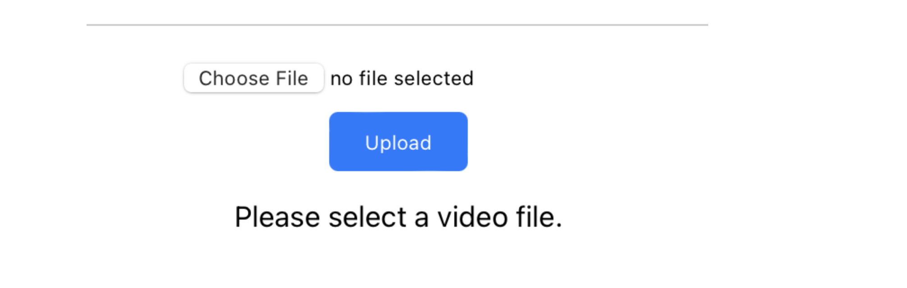
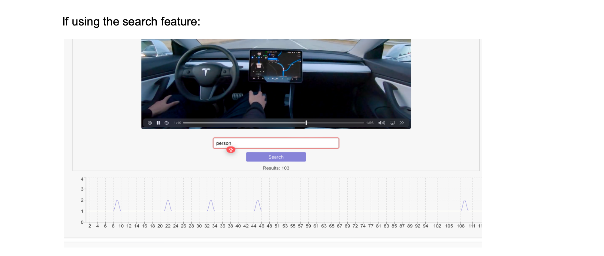
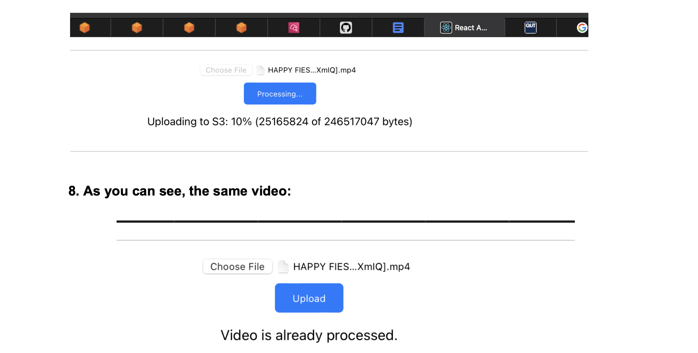
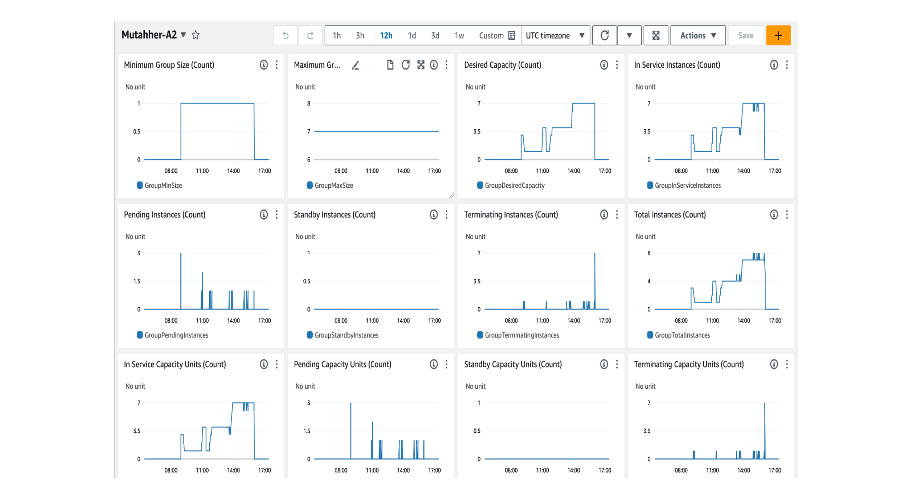

# AWS Video Analysis Pipeline 🎥  


*A scalable, cloud-based video analysis system built on AWS and Google Vision API.*

---

## 📘 Overview
This project was developed for **CAB432: Cloud Computing** by **Mutahher Naseer** and **Bismillah Sultani**.  
The system bridges the gap between raw video data and meaningful analytics by automating video processing, frame extraction, and object detection using cloud-based architecture.

🔒 **Security Notice**  
All AWS credentials, API keys, and access tokens used during the original deployment have been **revoked and are no longer active**.  
This repository is provided solely for **educational and portfolio demonstration purposes** — no live services or secrets are exposed.

## 🚀 Running the Project

> ⚠️ **Note:**  
> This project was originally deployed using AWS EC2 instances, S3, SQS, and Redis (ElastiCache).  
> The cloud resources have since been discontinued — the instructions below describe the original setup for reference.

### 🧩 Prerequisites
- Node.js (v14+)
- AWS CLI configured with valid credentials
- Access to AWS services: **S3**, **SQS**, **EC2**, **ElastiCache (Redis)**, and **CloudWatch**

---

### 🏗️ 1. Clone the repository
```bash
git clone https://github.com/Vivid809/aws-video-analysis-pipeline.git
cd aws-video-analysis-pipeline
```

###  💻 2. Install Dependencies
```bash
npm install --prefix client
npm install --prefix server
npm install --prefix sqs
```

###  ⚙️ 3. Configure environment tables
```bash
AWS_ACCESS_KEY_ID=your_key
AWS_SECRET_ACCESS_KEY=your_secret
AWS_REGION=ap-southeast-2
S3_BUCKET=your-bucket-name
REDIS_HOST=your-redis-endpoint
SQS_QUEUE_URL=your-queue-url
```

###  🧠 4. Start local development
```bash npm
start --prefix client
npm start --prefix server
npm start --prefix sqs
```


Users can:
- Upload `.mp4` videos to an S3 bucket via a **React** web interface.  
- Automatically trigger analysis jobs through **SQS** and **Auto Scaling Groups (ASG)**.  
- View detected objects, their frequency, and timestamps within a processed video.  

---

## 🧩 Key Features
- **Automated pipeline:** S3 → SQS → EC2 (Auto Scaling) → Redis → Google Vision API.  
- **SHA-256 hashing** via Redis for duplicate video detection (prevents reprocessing).  
- **Horizontal scaling:** Scales EC2 workers dynamically based on queue load.  
- **Data visualization:** Generates object frequency graphs and searchable timestamps.  
- **Fault-tolerant design:** Stateless processing with managed message queues.


## 🧭 Architecture


The architecture follows core principles of **statelessness, persistence, and scalability**:
- **Load Balancer:** Distributes incoming user requests across EC2 instances.
- **Elasticache (Redis):** Stores hash keys for fast lookup of previously processed videos.
- **S3 Bucket:** Stores raw uploads, extracted frames, and result metadata.
- **SQS Queue:** Triggers worker instances to process new uploads.
- **EC2 Auto Scaling Group:** Dynamically scales between 1–7 instances based on queue size.
- **CloudWatch:** Monitors queue depth and CPU utilization; triggers scaling alarms.
- **Google Vision API:** Labels objects and returns frame-level metadata.

## 📡 SQS + Auto Scaling (Network flow)


Each new upload to S3 triggers an SQS message.  
- CloudWatch monitors **ApproximateNumberOfMessages** in the queue.  
- When thresholds are breached, the **Auto Scaling Group** launches new EC2 instances.  
- As the queue drains, instances automatically scale down to reduce cost.

## 💡 Project Preview

> The EC2 instances and AWS services for this project have been discontinued.  
> The screenshots below demonstrate the local and cloud workflow from the original deployment.

<table>
<tr>
<td align="center"><b>🎥 Upload Interface</b></td>
<td align="center"><b>🔍 Search & Analytics (Vision API)</b></td>
</tr>
<tr>
<td></td>
<td></td>
</tr>

<tr>
<td align="center"><b>♻️ Duplicate Detection (Redis Cache)</b></td>
<td align="center"><b>📊 Auto-Scaling Metrics (CloudWatch)</b></td>
</tr>
<tr>
<td></td>
<td></td>
</tr>
</table>


---

## ⚙️ Technical Components
**Frontend (client):**
- Built in React.js for intuitive uploads and progress tracking.
- Displays top object graphs and searchable timestamps.

**Backend (server):**
- Node.js with Express, AWS SDK, and Crypto-js (SHA-256 hashing).  
- Generates pre-signed S3 URLs and publishes SQS messages.

**Worker (SQS handlers):**
- Polls SQS queue → fetches video from S3 → extracts frames via ffmpeg → sends to Vision API → saves labeled output to S3.

**Testing utilities:**
- Synthetic video upload generator for stress testing scaling events.
- Python scaling script to trigger CloudWatch alarms.

---

## 🧠 Scaling & Performance
Two Auto Scaling Groups manage the pipeline:
1. **Server ASG** — handles upload traffic (t2.micro, min=1, max=3).  
2. **Worker ASG** — handles SQS processing load (t2.medium, min=1, max=7).  

Load generation and queue monitoring were validated using CloudWatch metrics.  
Scaling was successfully triggered by running a Python script that bulk-uploaded test videos, simulating heavy queue activity.

---


## 🧩 Services & Libraries
- **AWS SDK** – S3, SQS, EC2, CloudWatch, IAM integration  
- **Google Vision API** – object detection and labeling  
- **FFmpeg** – frame extraction  
- **Redis (Elasticache)** – hash key lookup for deduplication  
- **Crypto-js** – SHA-256 hashing  
- **React / Node.js** – front-end and server logic

---

## 🚀 How It Works (End-to-End)
1. User uploads an `.mp4` video via the React app.  
2. The video is stored in an **S3 bucket** and a message is sent to **SQS**.  
3. **CloudWatch alarm** detects new messages → triggers **ASG scale-out**.  
4. Worker instances fetch the message, process the video, and tag frames.  
5. Results (JSON metadata + labeled frames) are saved back to S3.  
6. The UI displays graphs and allows timestamp search for detected objects.  

---

## 🗂️ Repository Structure

```
aws-video-analysis-pipeline/
├── client/ # React front-end for uploads, graphs, and search
├── server/ # Node.js backend (presigned S3 URLs, Redis de-dup, API)
├── sqs/ # Worker logic (polls SQS, runs ffmpeg, calls Vision API)
├── testing/ # Scripts to generate synthetic load and trigger scaling
├── Architecture Diagram.png # System architecture visualization
├── Network Diagram.png # SQS + Auto Scaling workflow diagram
├── .gitignore
└── README.md
```


## 🧠 Future Enhancements
- Integrate **Face Detection** for emotion and expression analysis.  
- Implement **facial recognition** or **object tracking** across frames.  
- Introduce **cost optimization** with spot instances and lifecycle hooks.  

---

## 👥 Authors
**Mutahher Naseer**  
**Bismillah Sultani**

## 📚 References
1. [AWS SQS with Auto Scaling Group (ASG) – Dilshan Fernando](https://enlear.academy/sqs-with-auto-scaling-group-asg-e2cd30100cad)  
2. [Sending and Receiving Messages in Amazon SQS (AWS Docs)](https://docs.aws.amazon.com/sdk-for-javascript/v2/developer-guide/sqs-examples-send-receive-messages.html)  
3. [Cloud Vision API Documentation – Google](https://cloud.google.com/vision/docs)  
4. [Persistent Storage for Cloud Applications – Synopsys](https://www.synopsys.com/cloud/insights/persistent-storage.html)

